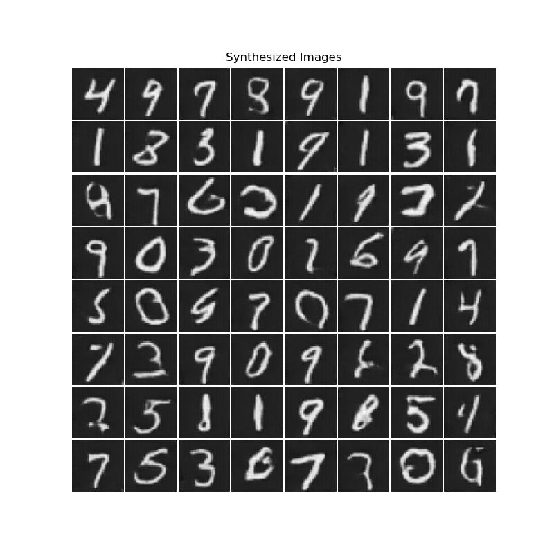

## Introduction to GANs

<p align="center">

</p>

**DCGAN** or _Deep Convolutional Generative Adversarial Network_ is one of the most popular implementations/architectures of **GANs** (Generative Adversarial Networks).

As the name suggests, a generative model is a neural network or an algorithm that aims to replicate/match the distribution of a given dataset by generating samples that resemble the real data which we wish to replicate.

A GAN is composed of two networks; the **generator** and the **discriminator**.

the generator is tasked with generating or creating data one sample at a time;
the discriminator is tasked to distinguish between the data that the generator is producing (aka the fake distribution) and the data that we wish to synthesize (aka the real distribution)

The generator's objective is to bypass the discrimination by continuously improving its capabilities in synthesis, so that the discriminator would not be able to tell apart the differences between fake and real, and the discriminator's objective is to improve its perception of real and fake distributions to enhance its discrimination capabilities.

It's evident that the relationship between these two is of adversarial type; hence the term Generative Adversarial Network.

## DCGAN

<p align="center">

</p>

**DCGAN** is a class of CNNs in unsupervised learning; an architecture for GANs, made-up of transposed-convolutions, strided convolutions & duct tape. There is no upsampling or downsampling done via pooling.

#### Some Properties of DCGAN
- no fully-connected layers
- transposed-convolutions for upsampling
- generator employes the ReLU non-linearity for all layers. The last layer uses tanh.
- discriminator uses Leaky-ReLU instead with leakyness of 0.2. Last layer uses sigmoid.

you can read more about the DCGAN architecture [here](#references)

There are however some differences with DCGAN and this implementation. I did not use any batch normalization for this project, which causes the flickering in the above gif; feel free to add if required.

## Additional Images

<p align="center">

</p>

## Usage

Simply download all the python files into a folder, then run the **train.py** file by typing into the terminal:

```bash
python3 train.py
```

this will train the network on the **MNIST** dataset automatically

but you may want to change some options before training. In that case simply edit the __options.py__ file. It looks something like this.

```python
# number of channels in the images (3 for RGB)
op_nc = 1

# batch size for both networks
op_batch_size = 64

# number of GPUs to use (pass 0 for CPU)
op_gpu = 1

# maximum convolution channels to incorporate
op_conv_channels = 256

# latent space size (100 in the paper)
op_nz = 64

...
```

Don't train the network for too many epochs because it will overfit very quickly.
4 or 5 is good for MNIST.

### Dataset
By default the MNIST dataset is selected for training. You can change it by editing the train.py file. Simply change this part:

```python
# uses the MNIST dataset by default
dataset = torchvision.datasets.MNIST(
    root=op_train_data_path, train=True, transform=data_transforms, download=True)
```

if you don't like to use the predefined pytorch datasets you can also download your own and configure the project to use it.

don't forget to change the data dimensionality in the **options.py** if you ever decide to use any other dataset.

```python
# images will be resized to this value
op_image_size = 64

# number of channels in the images (3 for RGB)
op_nc = 1
```

## Observe the result

After you trained the network for some time, you probably want to look at what it did.

to make image visualizations, run:

```bash
python3 make_samples.py
```

to make a video that interpolates the latent space, run:

```bash
python3 interpolate.py
```

configure these operations by editing the option file.

***to get rid of the background flickering, use a normalization technique like batch norm***

## Requirements

- Pytorch
- Matplotlib
- Numpy
- One lone data science enthusiast

## References

***Alec Radford, Luke Metz, Soumith Chintala***
_Unsupervised Representation Learning with Deep Convolutional Generative Adversarial Networks_ [arvix](https://arxiv.org/abs/1511.06434)

***Ian J. Goodfellow, Jean Pouget-Abadie, Mehdi Mirza, Bing Xu, David Warde-Farley, Sherjil Ozair, Aaron Courville, Yoshua Bengio***
_Generative Adversarial Networks_ [arvix](https://arxiv.org/abs/1406.2661)

***Ian Goodfellow***
_NIPS 2016 Tutorial: Generative Adversarial Networks_ [arvix](https://arxiv.org/abs/1701.00160)

[***Pytorch DCGAN Tutorial***](
https://pytorch.org/tutorials/beginner/dcgan_faces_tutorial.html)

[***Pytorch Documents***](https://pytorch.org/docs/stable/index.html)

[***Anime Face Dataset***](https://www.kaggle.com/datasets/splcher/animefacedataset)